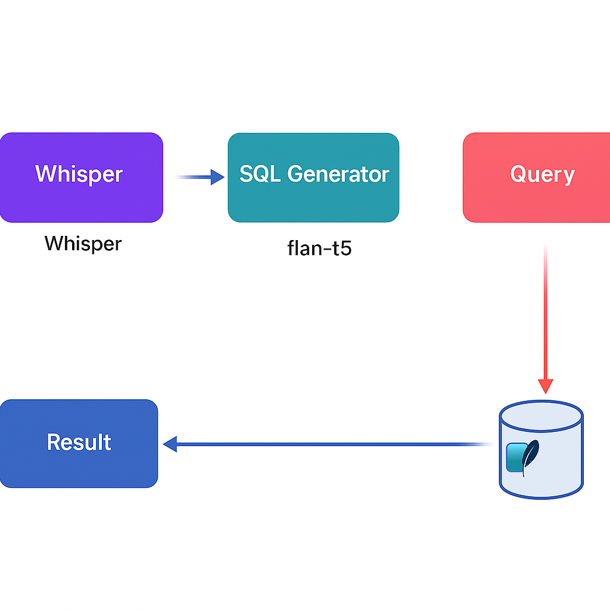
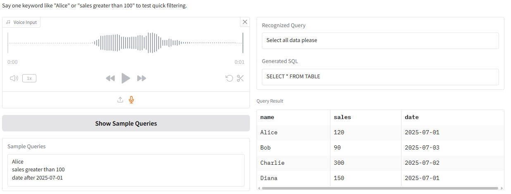

# Echo FLAN2SQL (Voice-to-SQL AI)

[](https://www.python.org/)  
[](https://huggingface.co/docs/transformers/index)  
[](https://gradio.app/)

This project demonstrates a **voice-driven SQL query generator** that converts voice input into natural language queries, generates SQL statements using AI models, and executes them on a mock database.

---

## Features
- **Voice-to-Text**:
  - Speech input processed by `facebook/wav2vec2-base-960h`
- **Text-to-SQL**:
  - SQL generation powered by `google/flan-t5-large`
- **Mock Database Query**:
  - Runs SQL-like queries on a Pandas DataFrame (no external DB required)
- **Interactive Web UI** built with Gradio (Hugging Face Spaces compatible)

---

## Architecture


- **STT Model**: Converts speech to text (`facebook/wav2vec2-base-960h`)
- **SQL Generator**: Translates text to SQL (`google/flan-t5-large`)
- **Query Executor**: Executes SQL-like queries on an in-memory dataset
- **Result**: Returns query results as a formatted table

---

## Live Demo  
[**👉 Try it on Hugging Face Spaces**](https://huggingface.co/spaces/eunki-7/wav2vec-flan-sql)

---

## Source Code  
[**📂 View on GitHub**](https://github.com/eunki-7/wav2vec-flan-sql-portfolio)

---

## How It Works
1. User provides a voice query via the Gradio interface.
2. The STT model (`wav2vec2-base-960h`) converts speech to text.
3. The text-to-SQL model (`flan-t5-large`) generates an SQL statement.
4. A Pandas DataFrame simulates database query execution.
5. The results are displayed as a table in the web UI.

---

## Tech Stack
- [Gradio](https://gradio.app/) – Web UI
- [Transformers](https://huggingface.co/docs/transformers/index) – Model inference
- Pandas – Mock database
- Python 3.10+

---

## Installation & Run
```bash
pip install -r requirements.txt
python app.py
```

---

## Example UI


- This is the web-based interface built with Gradio

---

## Use Cases
- Quick demo of **voice-based SQL generation**
- Educational projects for LLM + STT pipeline learning
- Lightweight proof-of-concept for voice-driven database query systems
- Enterprise prototype for natural language database access

---

## Notes
- The first response may take a few seconds due to model loading (CPU-only environments).
- Subsequent requests are faster due to caching.

---

## Author
**eunki7**  
- [GitHub Profile](https://github.com/eunki-7)
